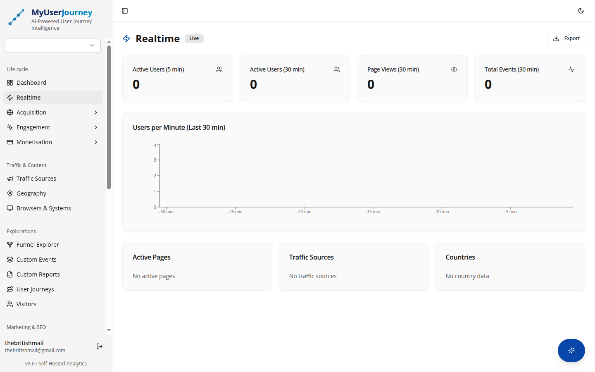
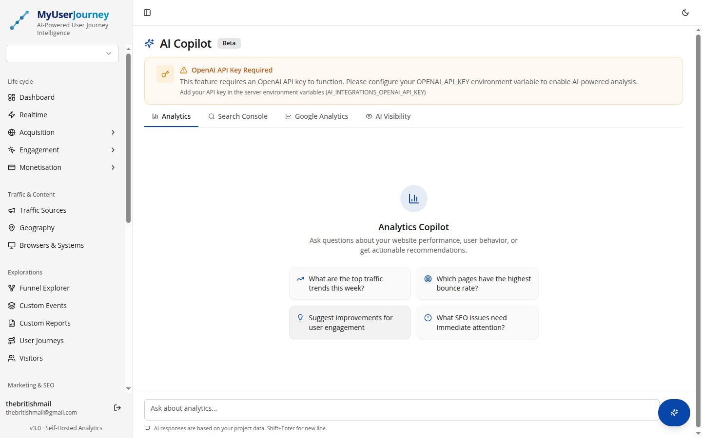
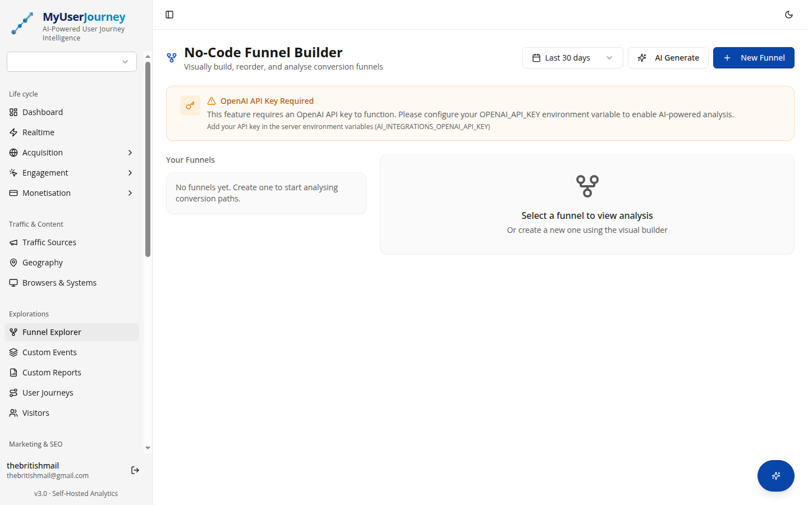
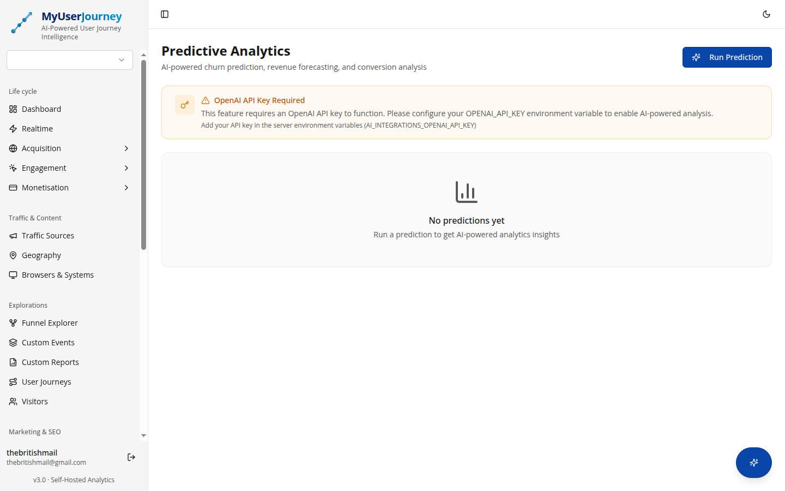
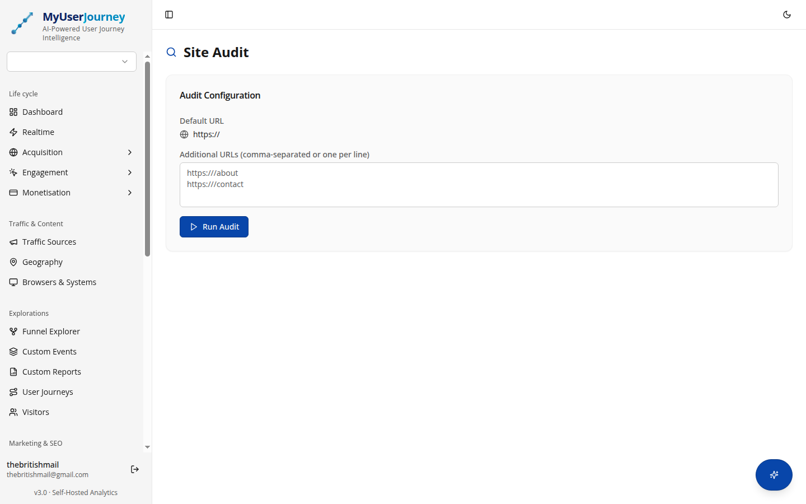
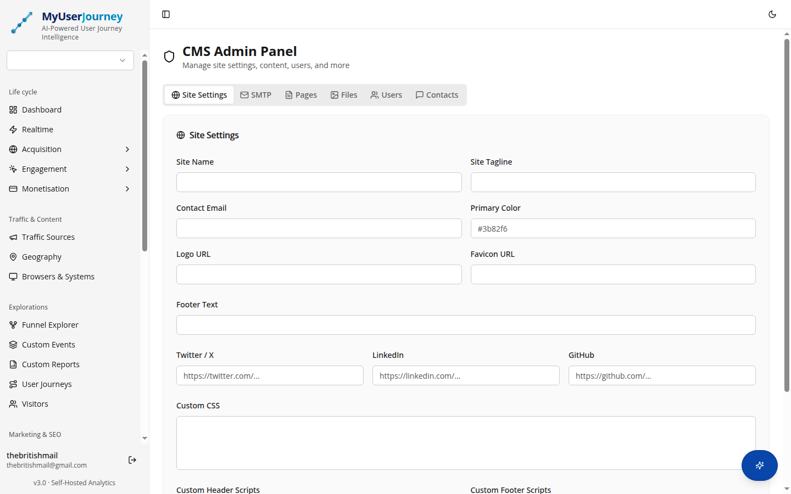
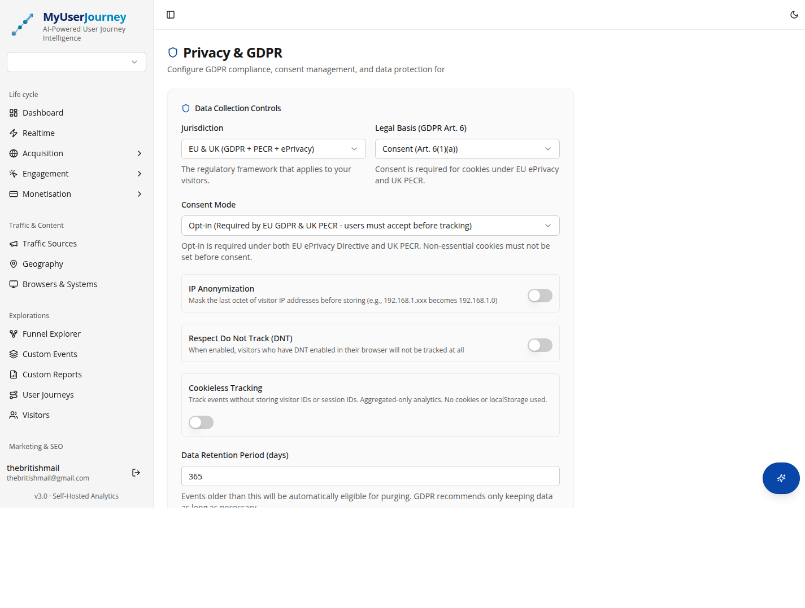

<p align="center">
  
</p>

<h1 align="center">MyUserJourney</h1>

<p align="center">
  <strong>AI-Powered Analytics, CMS & Marketing Platform</strong>
  <br />
  The privacy-first alternative to Google Analytics with built-in AI insights, CMS, SEO tools, and GDPR compliance.
</p>

<p align="center">
  <a href="https://myuserjourney.co.uk">Website</a> &middot;
  <a href="#features">Features</a> &middot;
  <a href="#getting-started">Getting Started</a> &middot;
  <a href="whitepaper.md">Whitepaper</a> &middot;
  <a href="CONTRIBUTING.md">Contributing</a> &middot;
  <a href="CHANGELOG.md">Changelog</a>
</p>

<p align="center">
  <a href="https://github.com/RakshakIT/myuserjourney/actions/workflows/ci.yml">
    
  </a>
  <a href="https://github.com/RakshakIT/myuserjourney/blob/main/LICENSE">
    
  </a>
  <a href="https://github.com/RakshakIT/myuserjourney/stargazers">
    
  </a>
  <a href="https://github.com/RakshakIT/myuserjourney/releases">
    
  </a>
  <a href="https://github.com/RakshakIT/myuserjourney/commits/main">
    
  </a>
  <a href="https://github.com/RakshakIT/myuserjourney/issues">
    
  </a>
</p>

<p align="center">
  
  
  
  
  
  
  
  
</p>

---

## Screenshots

<p align="center">
  
  <br />
  <em>Dashboard Overview - Key analytics at a glance with comparison stats</em>
</p>

<details>
<summary><strong>View more screenshots</strong></summary>

<p align="center">
  
  <br />
  <em>Real-time Analytics - Active users, per-minute activity, top content</em>
</p>

<p align="center">
  
  <br />
  <em>AI Insights - Ask questions about your analytics in plain English</em>
</p>

<p align="center">
  
  <br />
  <em>No-Code Funnel Builder - Visual drag-and-drop with AI generation</em>
</p>

<p align="center">
  
  <br />
  <em>Predictive Analytics - Churn risk, revenue forecasting, conversion predictions</em>
</p>

<p align="center">
  
  <br />
  <em>SEO Site Audit - HTML crawling with issue detection and scoring</em>
</p>

<p align="center">
  
  <br />
  <em>Admin Panel - CMS pages, file manager, user management, SMTP config</em>
</p>

<p align="center">
  
  <br />
  <em>Privacy Settings - GDPR consent management with 55+ jurisdiction support</em>
</p>

</details>

---

## The Problem

Businesses face an impossible choice: use powerful analytics platforms that compromise user privacy and send data to third-party servers, or use privacy-focused alternatives that lack advanced features.

Google Analytics 4 raises GDPR adequacy concerns with cross-border data transfers. Microsoft Clarity records sessions without granular consent. Amplitude and Mixpanel charge premium prices that exclude SMEs. **None of them** offer integrated AI insights, CMS, SEO auditing, and PPC management in a single self-hosted solution.

## The Solution

MyUserJourney eliminates this trade-off by combining in a **single self-hosted platform**:

- Real-time behavioural analytics with predictive AI
- Natural language analytics queries ("What drove conversions last week?")
- Automated UX auditing and SEO site analysis
- A complete CMS with contact forms and file management
- Full GDPR/PECR compliance by design, not as an afterthought

All self-hosted. All your data stays on your server.

---

## Features

### Analytics Engine

| Feature | Description |
|---------|-------------|
| **Real-time Dashboard** | Active users, per-minute activity charts, top content |
| **Acquisition Analytics** | Traffic source breakdown, referrer analysis, campaign tracking |
| **Engagement Metrics** | Event types, pages, landing pages, session duration |
| **Live Event Stream** | Real-time event feed with multi-dimensional filtering |
| **User Journey Replay** | Session reconstruction and timeline views |
| **Visitor Profiles** | Aggregated visitor data with export capabilities |
| **Traffic Classification** | Organic, social, paid, referral, email, display, affiliate, direct |
| **Geography Analytics** | Country, city, and language distribution |
| **Browser & Device** | Browser, OS, and device type breakdowns |
| **Pages Analysis** | Top pages, entry/exit pages, 404 detection |
| **Funnel Builder** | No-code visual builder with drag-and-drop and AI generation |
| **Custom Events** | Rule-based event matching with AI-generated templates |
| **Custom Reports** | Flexible report builder with AI-powered generation |

### AI-Powered Intelligence

| Feature | Description |
|---------|-------------|
| **AI Insights Chat** | Ask questions about your analytics in plain English |
| **Predictive Analytics** | Churn risk scoring, revenue forecasting, conversion predictions |
| **AI UX Auditor** | Detect slow pages, poor UX flows, and confusing navigation |
| **AI Marketing Copilot** | SEO fix suggestions, PPC budget optimisation, UX recommendations |
| **AI Funnel Generation** | Describe a funnel in words, get it built automatically |
| **AI Report Generation** | Generate custom reports from natural language prompts |
| **AI Event Templates** | Auto-generate conversion tracking for leads, purchases, and more |
| **Site Research** | Real website crawling with AI-powered competitive analysis |

### CMS & Content Management

| Feature | Description |
|---------|-------------|
| **Dynamic Pages** | Create and manage pages via admin panel |
| **File Manager** | Upload and manage files with drag-and-drop |
| **Contact Form** | Built-in contact form with SMTP email notifications |
| **SEO Metadata** | Per-page title, description, and meta tag management |
| **Site Branding** | Customisable name, tagline, colours, and social links |
| **Tracking Codes** | 15+ analytics platform integrations (GA, GTM, Pixel, etc.) |

### Privacy & Compliance

| Feature | Description |
|---------|-------------|
| **GDPR/PECR** | Full UK and EU privacy regulation support |
| **Consent Banner** | Customisable with 6 categories, 3 layouts, 5 positions |
| **IP Anonymisation** | Automatic last-octet anonymisation |
| **Do Not Track** | Honours browser DNT headers |
| **Cookieless Mode** | Tracking without cookies or persistent identifiers |
| **Right to Erasure** | One-click visitor data deletion |
| **Data Portability** | Export visitor data as JSON/CSV |
| **55+ Jurisdictions** | Global privacy law support (EU, US states, APAC, etc.) |

### Marketing & SEO

| Feature | Description |
|---------|-------------|
| **Site Audit** | HTML crawling with SEO issue detection and scoring |
| **PPC Campaigns** | Campaign tracking and performance analytics |
| **Site Research** | Competitive research with real website crawling |

---

## Feature Comparison

> Based on publicly available feature documentation as of February 2026. See the [Whitepaper](whitepaper.md) for detailed analysis.

| Feature | MyUserJourney | GA4 | Plausible | PostHog | Matomo |
|---------|:---:|:---:|:---:|:---:|:---:|
| Real-time analytics | Yes | Yes | Yes | Yes | Yes |
| AI insights chat | Yes | No | No | No | No |
| Predictive analytics | Yes | Limited | No | No | No |
| AI UX auditor | Yes | No | No | No | No |
| Built-in CMS | Yes | No | No | No | No |
| SEO site audit | Yes | No | No | No | No |
| PPC management | Yes | Via Ads | No | No | No |
| Consent management | Yes | Partial | N/A | Partial | Yes |
| Self-hosted | Yes | No | Yes | Yes | Yes |
| GDPR by design | Yes | No | Yes | Partial | Yes |
| 55+ jurisdiction support | Yes | No | No | No | No |
| Free core analytics | Yes | Yes | No | Yes | Yes |
| Open source | MIT | No | AGPL | MIT | GPL |

---

## Tech Stack

| Layer | Technology |
|-------|-----------|
| **Frontend** | React 18, TypeScript, Vite, Tailwind CSS, Shadcn UI |
| **State Management** | TanStack React Query v5 |
| **Charts** | Recharts |
| **Routing** | Wouter |
| **Backend** | Node.js, Express.js, TypeScript |
| **Database** | PostgreSQL (27 tables) |
| **ORM** | Drizzle ORM |
| **Authentication** | Passport.js (Local + Google OAuth 2.0) |
| **AI** | OpenAI API (GPT-4o-mini) |
| **Payments** | Stripe (pay-as-you-go invoicing) |
| **Email** | Nodemailer |

---

## Getting Started

### Prerequisites

- Node.js 18+
- PostgreSQL 14+
- npm 9+

### Quick Start

```bash
# Clone the repository
git clone https://github.com/RakshakIT/myuserjourney.git
cd myuserjourney

# Install dependencies
npm install

# Configure environment
cp .env.example .env
# Edit .env with your DATABASE_URL and SESSION_SECRET

# Push database schema (creates all 27 tables)
npm run db:push

# Start the development server
npm run dev
```

The application will be available at `http://localhost:5000`.

### Environment Variables

| Variable | Required | Description |
|----------|:--------:|-------------|
| `DATABASE_URL` | Yes | PostgreSQL connection string |
| `SESSION_SECRET` | Yes | Secret key for session encryption |
| `GOOGLE_CLIENT_ID` | No | Google OAuth 2.0 Client ID |
| `GOOGLE_CLIENT_SECRET` | No | Google OAuth 2.0 Client Secret |
| `OPENAI_API_KEY` | No | OpenAI API key for AI features |
| `STRIPE_SECRET_KEY` | No | Stripe secret key for billing |
| `ADMIN_EMAIL` | No | Auto-promote this email to admin on startup |

Generate a secure session secret:

```bash
node -e "console.log(require('crypto').randomBytes(64).toString('hex'))"
```

See `.env.example` for the complete list.

---

## Creating Your Admin Account

**Option A: Auto-promote (recommended)**

Set `ADMIN_EMAIL=your@email.com` in `.env`, then register with that email. The account is automatically promoted to admin on each startup.

**Option B: Seed account**

Set `ADMIN_DEFAULT_PASSWORD=your-strong-password` in `.env`. A default admin is created at `admin@analytics.io` on first startup.

**Option C: SQL**

```sql
UPDATE users SET role = 'admin' WHERE email = 'your@email.com';
```

---

## Project Structure

```
myuserjourney/
├── client/                    # React frontend (Vite + TypeScript)
│   └── src/
│       ├── components/        # Reusable UI components (Shadcn)
│       ├── hooks/             # Custom React hooks
│       ├── lib/               # Utilities and API client
│       └── pages/             # Route page components
├── server/                    # Express backend (TypeScript)
│   ├── auth.ts                # Authentication (Passport.js + OAuth)
│   ├── routes.ts              # API route handlers
│   ├── storage.ts             # Database access layer (Drizzle ORM)
│   ├── ai-service.ts          # AI/LLM integration
│   └── stripe-billing.ts     # Stripe pay-as-you-go billing
├── shared/
│   └── schema.ts              # Database schema (27 tables) + Zod types
├── .github/                   # CI/CD workflows and templates
├── CHANGELOG.md               # Version history
├── CONTRIBUTING.md            # Contribution guidelines
├── SECURITY.md                # Security policy
├── LICENSE                    # MIT License
└── whitepaper.md              # Technical whitepaper
```

---

## Architecture

```
┌──────────────────────────────────────────────────────────────┐
│                      Client (Browser)                        │
│   React 18 + TypeScript + Tailwind CSS + Shadcn UI           │
│   TanStack Query for state  |  Wouter for routing            │
└────────────────────────┬─────────────────────────────────────┘
                         │ HTTPS
┌────────────────────────▼─────────────────────────────────────┐
│                    Express.js Server                          │
│  ┌───────────┐  ┌───────────┐  ┌──────────┐  ┌───────────┐  │
│  │   Auth    │  │  Routes   │  │    AI    │  │  Stripe   │  │
│  │ Passport  │  │  REST API │  │  OpenAI  │  │ Billing   │  │
│  └───────────┘  └───────────┘  └──────────┘  └───────────┘  │
│  ┌──────────────────────────────────────────────────────┐    │
│  │              Storage Layer (Drizzle ORM)              │    │
│  └────────────────────────┬─────────────────────────────┘    │
└───────────────────────────┼──────────────────────────────────┘
                            │
┌───────────────────────────▼──────────────────────────────────┐
│                   PostgreSQL Database                         │
│                27 tables, type-safe queries                   │
└──────────────────────────────────────────────────────────────┘
```

For a detailed technical deep-dive, see the [Whitepaper](whitepaper.md).

---

## API Reference

### Authentication

| Method | Endpoint | Description |
|--------|----------|-------------|
| `POST` | `/api/auth/register` | Register new account |
| `POST` | `/api/auth/login` | Email/password login |
| `GET` | `/api/auth/google` | Initiate Google OAuth |
| `GET` | `/api/auth/me` | Get current user |
| `POST` | `/api/auth/logout` | Log out |
| `POST` | `/api/auth/forgot-password` | Request password reset |
| `POST` | `/api/auth/reset-password` | Reset password with token |

### Analytics

| Method | Endpoint | Description |
|--------|----------|-------------|
| `POST` | `/api/events` | Collect tracking event |
| `GET` | `/api/projects/:id/stats` | Dashboard statistics |
| `GET` | `/api/projects/:id/realtime` | Real-time analytics |
| `GET` | `/api/projects/:id/acquisition` | Acquisition data |
| `GET` | `/api/projects/:id/engagement` | Engagement metrics |
| `GET` | `/api/projects/:id/visitors` | Visitor list |

### CMS (Public)

| Method | Endpoint | Description |
|--------|----------|-------------|
| `GET` | `/api/public/site-settings` | Site branding |
| `GET` | `/api/public/pages` | Published pages |
| `GET` | `/api/public/pages/:slug` | Single page |
| `POST` | `/api/public/contact` | Submit contact form |

### Admin

| Method | Endpoint | Description |
|--------|----------|-------------|
| `GET/PUT` | `/api/admin/site-settings` | Site settings |
| `GET/PUT` | `/api/admin/smtp` | SMTP configuration |
| `CRUD` | `/api/admin/pages` | CMS pages |
| `CRUD` | `/api/admin/files` | File management |
| `CRUD` | `/api/admin/users` | User management |

---

## Deployment

### Production Build

```bash
npm run build
npm start
```

### Example nginx Configuration

```nginx
server {
    listen 443 ssl;
    server_name yourdomain.com;

    ssl_certificate /etc/letsencrypt/live/yourdomain.com/fullchain.pem;
    ssl_certificate_key /etc/letsencrypt/live/yourdomain.com/privkey.pem;

    location / {
        proxy_pass http://localhost:5000;
        proxy_http_version 1.1;
        proxy_set_header Upgrade $http_upgrade;
        proxy_set_header Connection 'upgrade';
        proxy_set_header Host $host;
        proxy_set_header X-Real-IP $remote_addr;
        proxy_set_header X-Forwarded-For $proxy_add_x_forwarded_for;
        proxy_set_header X-Forwarded-Proto $scheme;
    }
}
```

### Cloud Deployment

Works with any platform that supports Node.js and PostgreSQL:

- **Railway** - Connect GitHub for automatic deploys
- **Render** - Free tier with managed PostgreSQL
- **DigitalOcean** - App Platform or Droplets
- **AWS** - EC2, Lightsail, or ECS
- **Heroku** - Quick deploy with add-on PostgreSQL

---

## Pricing Model

**Core analytics are free forever.** AI features use a pay-as-you-go model:

- AI usage is tracked per feature with token counts
- Monthly usage under the threshold is free
- When usage exceeds the threshold, Stripe generates an automated invoice
- No subscriptions, no tiers - pay only for what you use

---

## Documentation

| Document | Description |
|----------|-------------|
| [Whitepaper](whitepaper.md) | Technical architecture and competitive analysis |
| [Changelog](CHANGELOG.md) | Version history and release notes |
| [Contributing](CONTRIBUTING.md) | How to contribute to the project |
| [Security](SECURITY.md) | Vulnerability reporting and security policy |
| [Code of Conduct](CODE_OF_CONDUCT.md) | Community standards |
| [License](LICENSE) | MIT License |

---

## Contributing

We welcome contributions of all kinds. See our [Contributing Guide](CONTRIBUTING.md) for details.

```bash
# Fork and clone the repo
git clone https://github.com/YOUR_USERNAME/myuserjourney.git

# Create a feature branch
git checkout -b feature/your-feature

# Make your changes and commit
git commit -m "feat(scope): description"

# Push and create a Pull Request
git push origin feature/your-feature
```

Look for issues tagged [`good first issue`](https://github.com/RakshakIT/myuserjourney/labels/good%20first%20issue) to get started.

---

## Security

Found a vulnerability? Please report it responsibly. See our [Security Policy](SECURITY.md) for details.

**Do not report security vulnerabilities through public GitHub issues.**

---

## Author

**Rakshak Mathur** - Sole architect, designer, and developer

- LinkedIn: [linkedin.com/in/rakshakmathur](https://uk.linkedin.com/in/rakshakmathur)
- Website: [myuserjourney.co.uk](https://myuserjourney.co.uk)
- GitHub: [RakshakIT](https://github.com/RakshakIT)

---

## License

MyUserJourney is open source under the [MIT License](LICENSE).

Copyright (c) 2026 Rakshak Mathur. All rights reserved.
